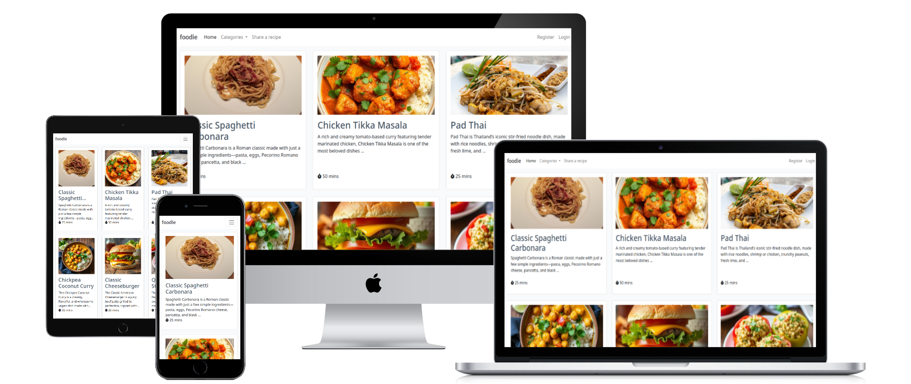
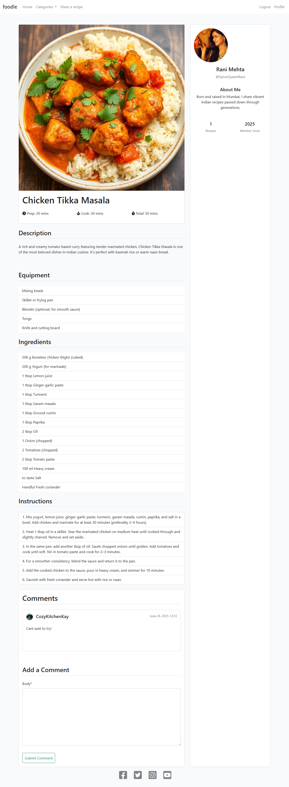
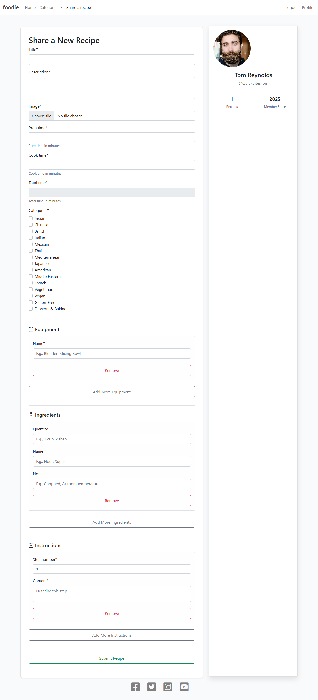
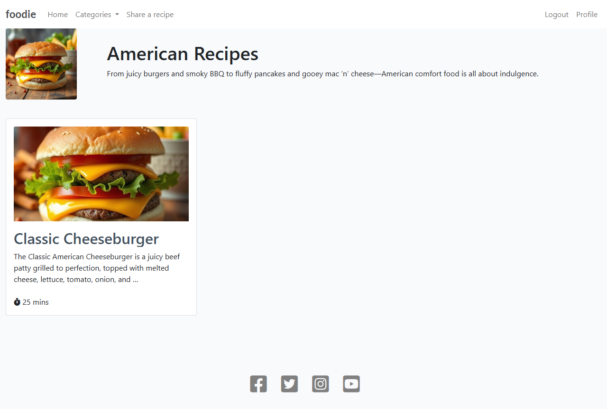

# foodie

foodie is a recipe-sharing platform where users can discover and share their favorite dishes. Browse a collection of recipes, share your own creations, and join the conversation with comments. A simple, social way to explore the world of cooking!



[View live site here](https://foodie-app-331441715045.herokuapp.com/)

## 📚 Table of Contents 

- [Planning](#planning)
  - [Target Audience](#target-audience)
  - [Project Goals](#project-goals)
  - [Feature Planning](#feature-planning)
- [Design](#design)
  - [Design Principles](#design-principles)
  - [Color Scheme](#color-scheme)
  - [Typography](#typography)
  - [Imagery](#imagery)
  - [Components and UI Elements](#components-and-ui-elements)
  - [Responsive Design](#responsive-design)
  - [Design for Accessibility](#design-for-accessibility)
  - [Wireframes](#wireframes)
- [Data Management](#data-management)
  - [User Data](#user-data)
  - [Recipe Data](#recipe-data)
- [Database Schema](#database-schema)
  - [Entity Relationship Diagram](#entity-relationship-diagram)
  - [Database Models](#database-models)
    - [User Profile Model](#user-model)
    - [Category Model](#category-model)
  - [Database Relationships](#database-relationships)
    - [One-to-One Relationships](#one-to-one-relationships)
    - [One-to-Many Relationships](#one-to-many-relationships)
    - [Many-to-Many Relationships](#many-to-many-relationships)
- [Features](#features)
  - [Navigation](#navigation)
    - [Main Menu](#main-menu)
    - [Homepage](#homepage)  
  - [Recipe Details](#product-details)
  - [User Profile](#user-profile)
  - [Category View](#category-view)
  - [Error Pages](#error-pages)
- [Technologies Used](#technologies-used)
  - [Languages](#languages-used)
  - [Frameworks, Libraries, Tools and platforms used](#frameworks-libraries-tools-and-platforms-used)
- [Credits](#credits)
  - [Content](#content)
  - [Media](#media)
- [Deployment](#deployment)
- [Testing](#testing)
- [Bugs](#bugs)


## Planning

### Target Audience

- Home cooks and food enthusiasts looking for new recipes
- Bloggers and content creators sharing their culinary ideas
- People who want to engage with a community by commenting on recipes

### Project Goals

- Create an easy-to-use platform for discovering and sharing recipes
- Foster community interaction through comments
- Provide a visually appealing, responsive, and accessible user experience

### Feature Planning

Based on MoSCoW prioritization, we identified the following features:

#### Must Have Features

- User authentication (signup/login)
- Share and view recipes
- Commenting system on recipes
- Responsive design for all devices
- Image upload for recipes
- Admin dashboard

#### Should Have Features

- Filter recipes by category
- User profiles with saved/uploaded recipes

#### Could Have Features

- Basic rating system (e.g., 1-5 stars)
- Search functionality
- Filter recipes by ingredients, cook time
- Social sharing (Twitter, Facebook, etc.)
- Recipe bookmarking/favorites

#### Won't Have Features (for now)

- Advanced meal-planning tools
- Video recipe uploads

## Design

### Design Principles

foodie's design follows these core principles:

- Simplicity: Clean, intuitive layouts prioritize usability.
- Consistency: Uniform buttons, fonts, and interactions for seamless navigation.
- Visual Hierarchy: Key actions (e.g., "Submit Recipe", "Delete Comment") stand out with color and spacing.

### Color Scheme

- Tomato Red

  - Used for interactive links (recipe titles, social media icons in the footer).

- Bootstrap Success Green

  - Submit buttons ("Share Recipe", "Save Changes", "Login").

- Bootstrap Danger Red

  - Delete/remove buttons ("Remove", "Logout").

- Neutral Backgrounds

  - Ensures readability and contrast.

### Typography

foodie inherits Bootstrap’s default font stack, designed for maximum readability across devices.

### Imagery

- Recipe images: High-quality photos are the centerpiece of each recipe card.

- User avatar images: Circular avatars appear next to recipe authors' names, creating a personal touch.

- Placeholder avatar images: Shown if no avatar is uploaded 

### Components and UI Elements

- Cards: Recipe cards with images, titles, and quick stats (likes, cooking time).

- Buttons: Rounded, interactive buttons for actions (submit, share, login).

- Navigation: Intuitive navbar with search functionality.

- Forms: Clean, user-friendly input fields for recipe creation and profile editing.

### Responsive Design

- Mobile (< 768px): Optimized for touch interactions, stacked layouts.

- Tablet/Desktop (768px+): Balanced grid layouts.

### Design for Accessibility

- Semantic HTML for screen readers.

- Sufficient color contrast.

- Keyboard-navigable interface.

## Wireframes

<details>
<summary>Home Page Wireframes</summary>

- [Desktop Home Page](media/readme/wireframes/desktop-homepage.png)
- [Tablet Home Page](media/readme/wireframes/tablet-homepage.png)
- [Mobile Home Page](media/readme/wireframes/mobile-homepage.png)
</details>

<details>
<summary>Recipe View Wireframes</summary>

- [Desktop Recipe View](media/readme/wireframes/desktop-recipe.png)
- [Tablet Recipe View](media/readme/wireframes/tablet-recipe.png)
- [Mobile Recipe View](media/readme/wireframes/mobile-recipe.png)
</details>

<details>
<summary>Category View Wireframes</summary>

- [Desktop Category View](media/readme/wireframes/category-view-desktop.png)
- [Tablet Category View](media/readme/wireframes/category-view-tablet.png)
- [Mobile Category View](media/readme/wireframes/mobile-category-view.png)
</details>

<details>
<summary>Login Page Wireframes</summary>

- [Desktop Login Page](media/readme/wireframes/signin-desktop.png)
- [Tablet Login Page](media/readme/wireframes/login-page-tablet.png)
- [Mobile Login Page](media/readme/wireframes/login-page-mobile.png)
</details>

<details>
<summary>Logout Page Wireframes</summary>

- [Desktop Logout Page](media/readme/wireframes/signout-desktop.png)
- [Tablet Logout Page](media/readme/wireframes/sign-out-tablet.png)
- [Mobile Logout Page](media/readme/wireframes/sign-out-mobile.png)
</details>

<details>
<summary>Sign-up Page Wireframes</summary>

- [Desktop Sign-up Page](media/readme/wireframes/sign-up-desktop-wireframe.png)
- [Tablet Sign-up Page](media/readme/wireframes/sign-up-tablet-wireframe.png)
- [Mobile Sign-up Page](media/readme/wireframes/sign-up-mobile-wireframe.png)
</details>

<details>
<summary>Profile Page Wireframes</summary>

- [Desktop Profile Page](media/readme/wireframes/profile-page-desktop-wireframe.png)
- [Tablet Profile Page](media/readme/wireframes/profile-page-tablet-wireframe.png)
- [Mobile Profile Page](media/readme/wireframes/profile-page-mobile-wireframe.png)
</details>

<details>
<summary>Share Recipe Wireframes</summary>

- [Desktop Share Recipe Page](media/readme/wireframes/share-recipe-desktop-wireframe.png)
- [Tablet Share Recipe Page](media/readme/wireframes/share-recipe-tablet-wireframe.png)
- [Mobile Share Recipe Page](media/readme/wireframes/share-recipe-page-mobile-wireframe.png)
</details>

## Data Management

### User Data

All personal data is protected through:

- HTTPS encryption
- Django's built-in security features

### Recipe Data

- Structured database using PostgreSQL for recipes.
- Comments stored with user references for moderation.

## Database Schema

### Entity Relationship Diagram

Below is the entity relationship diagram showing how different models are interconnected:


### Database Models

#### Users Model

The Users model extends Django's built-in User model to store users profile information:

```python
class Profile(models.Model):
    user = models.OneToOneField(User, on_delete=models.CASCADE)
    bio = models.TextField(max_length=500, blank=True)
    profile_image = CloudinaryField('image', blank=True, null=True, default=None)
```

**Key features**:

- One-to-one relationship with Django's User model
- Optional bio (500-character limit) and Cloudinary-hosted profile image
- Automatically created via signals when users register

#### Category Model

Organizes recipes into thematic groups (e.g., Vegan, Dessert):

```python
class Category(models.Model):
    name = models.CharField(max_length=50, unique=True)
    slug = models.SlugField(max_length=50, unique=True, blank=True)
    description = models.TextField(blank=True)
```

**Key features**:

- Auto-generated slugs from category names
- Optional descriptions
- Many-to-many relationship with recipes

#### Recipes Model

Core recipe content:

```python
class Recipe(models.Model):
    author = models.ForeignKey(User, on_delete=models.CASCADE)
    title = models.CharField(max_length=200)
    prep_time = models.PositiveIntegerField(help_text="Minutes")
    cook_time = models.PositiveIntegerField(help_text="Minutes")
    featured_image = CloudinaryField('image', default='placeholder')
    categories = models.ManyToManyField(Category, related_name='recipes', blank=True)
```

**Key features**:

- Time tracking (prep/cook/total) with auto-calculated total_time
- Cloudinary image hosting with default placeholder
- Categorization system with M:N relationships
- Automatic slug generation from title

#### Recipe Component Models

Modular design for recipe building blocks:

- Ingredients

```python
class Ingredient(models.Model):
    recipe = models.ForeignKey(Recipe, on_delete=models.CASCADE, related_name='ingredients')
    quantity = models.CharField(max_length=50, blank=True)
    name = models.CharField(max_length=100)
    notes = models.CharField(max_length=100, blank=True)
```
- Instructions

```python
class Instruction(models.Model):
    recipe = models.ForeignKey(Recipe, on_delete=models.CASCADE, related_name='instructions')
    step_number = models.PositiveIntegerField()
    content = models.TextField()
```

- Equipment

```python
class Equipment(models.Model):
    recipe = models.ForeignKey(Recipe, on_delete=models.CASCADE, related_name='equipment')
    name = models.CharField(max_length=100)
```

#### Comments Model

User-generated recipe comments:

```python
class Comment(models.Model):
    recipe = models.ForeignKey(Recipe, on_delete=models.CASCADE, related_name='comments')
    author = models.ForeignKey(User, on_delete=models.CASCADE, related_name='commenter')
    body = models.TextField()
    approved = models.BooleanField(default=False)
```

**Key features**:

- Moderation system (approved flag)
- Chronological ordering (newest first)
- Dual foreign keys to Recipe and User

### Database Relationships

#### One-to-One Relationships

User ↔ Profile

- Each Django User has exactly one Profile (extending user data)

- Each Profile links to exactly one User

#### One-to-Many Relationships

User → Recipes

- One User can author many Recipes
- Each Recipe belongs to one User

Recipe → Components

Each recipe can have:

- Many Ingredients
- Many Instructions
- Many Equipment entries

User → Comments

- One User can write many Comments
- Each Comment belongs to one User

Recipe → Comments

- One Recipe can have many Comments
- Each Comment belongs to one Recipe

#### Many-to-Many Relationships

Recipes ↔ Categories

- One Recipe can belong to many Categories (e.g., "Vegan" + "Italian")
- One Category can contain many Recipes

## Features

### Navigation

#### Navigation Bar

- Responsive Design: Transforms into a hamburger menu on mobile devices
- User Authentication: Login/Signup/Logout options that change based on authentication status
- Category Dropdown: Quick access to recipe categories
- Profile Link: Direct access to user profile for authenticated users

<details>
  <summary><strong>❌ Navigation Bar Image</strong></summary>
  <br>


</details>

#### Homepage 

- Recipe Card Grid Layout: Recipes are displayed in a responsive card layout with images, titles, brief descriptions, and cooking time.
- Quick Recipe Browsing: Users can quickly scan through recipes with concise previews and high-quality images.
- Consistent Styling: Clean and modern UI design for a seamless experience across devices.
- Time Indicator: Each recipe card displays an estimated cooking time to help users choose recipes based on their available time.
- Responsive Layout: Optimized for both desktop and mobile devices.

<details>
  <summary><strong>❌ Home Page Image</strong></summary>
  <br>


</details>

### Recipe Details

**Recipe Content**

- Hero Recipe Image: A large, high-quality image of the dish prominently displayed at the top for visual appeal.
- Cooking Times Overview: Clear breakdown of preparation time, cooking time, and total time, helping users plan their cooking session.
- Ingredients List: Easy-to-read, structured list of all required ingredients.
- Step-by-Step Instructions: Clearly numbered or sectioned cooking steps to guide users through the recipe from start to finish.
- Equipment Needed: A dedicated section listing any necessary cooking tools or utensils.

**Author Bio Sidebar**

- The profile image of the recipe author
- A short bio to personalize the experience
- The number of recipes shared by the author, fostering community trust
- Comment Section: Users can leave feedback, ask questions, and share tips with other cooks,    promoting community engagement and interaction.
- Responsive Layout: Optimized for both desktop and mobile devices for on-the-go cooking.

<details>
  <summary><strong>❌ Recipe Details Image</strong></summary>
  <br>


</details>

### User Profile

Editable Profile Information:
  - First and last name
  - Email address
  - Personal bio to share their cooking style or background

- Profile Image Upload: Users can upload or update their profile photo, with the option to clear the existing image.
- Clean Layout: A clear and simple two-column design separates form inputs and profile display, enhancing usability.
- Update Confirmation: Changes can be saved with the "Update Profile" button, providing immediate feedback and a smooth editing process.
- Responsive Design: Ensures usability across mobile and desktop views.

<details>
  <summary><strong>❌ User Profile Image</strong></summary>
  <br>


</details>

### Recipe Sharing

Recipe Metadata Inputs:
- Title, Description, and Image Upload
- Prep Time, Cook Time, and auto-calculated Total Time

Category Selection: 
- Users can tag their recipe with one or more categories (e.g. Indian, Vegan, Desserts) for better discoverability.

Dynamic Form Sections:
- Equipment: 
  -Add one or more pieces of equipment needed for the recipe, with the ability to remove or add more dynamically.
- Ingredients: 
  -Specify quantity, name, and notes for each ingredient. Multiple ingredients can be added with ease.
- Instructions: 
  -Add clear, step-by-step instructions with an automatically tracked step number.

Live Profile Sidebar:
- Displays the user's profile image, name, username, recipe count, and member since year while they’re creating a recipe.

Form Validation: 
- Required fields are marked and validated to ensure complete recipe submissions.

Responsive Layout: 
- Designed for both desktop and mobile, enabling users to share recipes on the go.

<details>
  <summary><strong>❌ Recipe Sharing Image</strong></summary>
  <br>


</details>

### Category View
Header Section:
- Category Image: A thumbnail representing the cuisine, randomly selected from any of the recipes in the category.
- Category Title: Large, bold heading (e.g., American Recipes).
- Category Description: A short summary describing the cuisine.

Recipe Card Layout:
- Each recipe is presented in a card containing:
- A high-quality thumbnail image
- Recipe title
- Brief description (truncated if too long)
- A clock icon with total time (e.g., “25 mins”)
- The card is clickable and leads to the full recipe detail.

Responsive Design:
- On wider screens: cards align neatly in a grid or flex layout.
- On narrower/mobile screens: cards stack vertically for readability.

Footer Icons:
- Social media icons (Facebook, Twitter, Instagram, YouTube) are neatly aligned and styled for consistent branding.

<details>
  <summary><strong>❌ Category View Image</strong></summary>
  <br>


</details>

#### Error Pages

Centered Error Message:
- Prominent message: "Oops! Page Not Found"
- Subtext explains: "Sorry, the page you're looking for doesn't exist. It might have been removed or the URL might be incorrect."

Call to Action:
- A clearly visible "Back to Home" button styled with a subtle border and green text—leading users safely back to the homepage.

Consistent Header & Footer:
- The global navbar (logo, navigation, and user links) remains at the top.
- Social media icons at the bottom provide a visual anchor and preserve layout consistency.

Design:
- Minimalist and clean.
- Uses a light background and central card box for clarity.
- Padding and rounded borders ensure the error card looks elegant and not abrupt.

<details>
  <summary><strong>❌ Error Page Image</strong></summary>
  <br>


</details>

## Technologies used

### Languages used

- HTML5

- CSS

- JavaScript

- Python

### Frameworks, Libraries, Tools and Platforms used

- Bootstrap 5.3.3

- Google Fonts

- Font Awesome

- Git

- GitHub

- Wireframes.cc

- Django

- Heroku

- PostgreSQL

- Chrome DevTools

## Credits

### Content

Entity Relationship Diagram was created with [dbdiagram](https://dbdiagram.io/)

Wireframes were created with [wireframes.cc](https://wireframes.cc)

Contents of the pages are created by [ChatGPT](https://openai.com)

### Media

The recipe and author profile images were sourced from Pixabay. All rights to the original content belong to their respective copyright holders.

- [Favicon](https://favicon.io/favicon-generator/)

- [Cloudinary](https://cloudinary.com/)

- [Icons](https://fontawesome.com/)

- [Images](https://pixabay.com/)

## Deployment

Stages of foodie deployment:

1. Creating GitHub respository
2. Setting up the local development environment
3. Configuring external services (Cloudinary, PostgreSQL)
4. Deploying to Heroku for production

#### Prerequisites

- **GitHub**: Code repository
- **Heroku**: For application hosting
- **Cloudinary**: For media file storage
- **Python 3.9+**: The programming language used for the application
- **Git**: For version control
- **pip**: Python package manager
- **PostgreSQL**: Database system

### Local Development Setup

#### Clone Repository

1. Navigate to the [foodie repository](https://github.com/PaulMarren/foodie)
2. Click the "Code" button and copy the repository URL
3. Open your terminal and run:

```
git clone https://github.com/PaulMarren/foodie.git
```

### Virtual Environment Setup

**For Windows:**
```
python -m venv venv
venv\Scripts\activate
```

**For macOS/Linux:**
```
python3 -m venv venv
source venv/bin/activate
```

### Installing Dependencies

```
pip install -r requirements.txt
```

Key dependencies:

- Django
- dj-database-url
- psycopg2
- django-allauth
- django-crispy-forms
- gunicorn
- whitenoise
- cloudinary

### Database Setup

1. Run migrations to set up the database:
```
python manage.py makemigrations
python manage.py migrate
```

2. Create a superuser for admin access:
```
python manage.py createsuperuser
```

### Development Environment Variables
Create a `.env` file in the root directory with the following variables:
```python
SECRET_KEY=your_django_secret_key
DEBUG=True
DEVELOPMENT=True
```

### Running the Development Server

Start the Django development server:
python manage.py runserver

The application should now be running at `http://127.0.0.1:8000/`.

## Heroku Deployment

### Creating a Heroku App

1. Log in to your [Heroku account](https://dashboard.heroku.com/)
2. Create a new app
3. Select the region closest to you

### Cloudinary Media Configuration

To manage media files in production:

1. Log in to your [Cloudinary account](https://cloudinary.com/)
2. Go to the **Dashboard** and copy your **CLOUDINARY_URL**
3. Add it to your Heroku config vars

Update your Django `settings.py` to use Cloudinary for default media storage:

```python
if 'CLOUDINARY_URL' in os.environ:
    DEFAULT_FILE_STORAGE = 'cloudinary_storage.storage.MediaCloudinaryStorage'
```

### Setting Environment Variables

#### Heroku Environment Variables

```python
SECRET_KEY=your_django_secret_key
DEBUG=False
DATABASE_URL=your_postgres_database_url
CLOUDINARY_URL=your_cloudinary_url
```

Configure environment variables in Heroku:

1. Go to the "Settings" tab in your Heroku dashboard
2. Click "Reveal Config Vars"
3. Add the following variables:

| Key | Value |
|-----|-------|
| SECRET_KEY | your_django_secret_key |
| DATABASE_URL | your_postgresql_url |
| CLOUDINARY_URL | your_cloudinary_url |
| DEBUG | False |

### Automatic Deployment Setup

1. Go to the "Deploy" tab in your Heroku dashboard
2. In the "Deployment method" section, select "GitHub"
3. Connect your GitHub repository
4. Scroll down to "Automatic deploys" and select the branch to deploy
5. Click "Enable Automatic Deploys"

### Testing

### Testing Environment

Testing was conducted across the following environments:

Devices: 
- Desktop computers (Windows)
- Laptops (13", 15", 17" screens)
- Tablets (Samsung Galaxy, iPad Pro)
- Mobile devices (iPhone, Samsung Galaxy)

Browsers:

- Google Chrome
- Mozilla Firefox
- Microsoft Edge

Screen Resolutions:

- Mobile: 320px - 480px
- Tablets: 768px - 1024px
- Laptops/Desktops: 1024px - 1920px

## Manual Testing

### User Stories Testing

#### User Management**

|Passed | **User Registration** - As a new user, I want to register an account so that I can share and interact with recipes.|
|:---:|:---|
|&check;| Registration form includes fields for username, email, and password.|
|&check;| Password strength requirements are enforced.|
|&check;| Redirects to homepage after account creation.|

|Passed | **User Login** - As a registered user, I want to log in to my account so that I can access my personal information.|
|:---:|:---|
|&check;| Login form accepts username and password.|
|&check;| "Remember me" functionality keeps users logged in between sessions.|
|&check;| Appropriate error messages display for invalid credentials.|
|&check;| Redirect to intended page after successful login.|

|Passed | **User Profile Management** - As a logged-in user, I want to view and edit my profile information.|
|:---:|:---|
|&check;| Profile page displays all current user information.|
|&check;| User can edit name, email and profile avatar.|
|&check;| Changes are saved immediately upon submission.|

#### Recipes**

|Passed | **Recipe Browsing by Category** - As a user, I want to browse recipes by category so that I can easily find recipes for my favourite food.|
|:---:|:---|
|&check;| Categories are displayed in navigation menu on every page.|
|&check;| Clicking a category shows all recipes within that category.|
|&check;| Active category title is display along with description of category.|
|&check;| Randomly selected images from a recipe in that category is displayed alongside description.|

|Passed | **Recipe Detail View** - As a user, I want to view detailed information about a recipe so that I can easily follow along and create it myself.|
|:---:|:---|
|&check;| Recipe detail page shows recipe image, title, cooking times, ingredients required, equipment required and cooking instructions.|
|&check;| Recipe author section is displayed alongside the recipe.|

|Passed | **Recipe Detail View** - As a logged-in user, I want to create and publish recipes so that others can view them.|
|:---:|:---|
|&check;| Share recipe page has appropriate fields required for a recipe.|
|&check;| Error messages display for required fields.|

|Passed | **Recipe Detail View** - As a logged-in user, I want be able leave comments on recipes.|
|:---:|:---|
|&check;| Recipe detail page has comment section showing previously approved comments, the comment authors username, avatar and comment creation date.|
|&check;| New comments require approval from admin and notify the commenter that approval is pending.|
|&check;| Comments have edit/detete functions.|
|&check;| Edited comments require re-approval.|

#### Admin Features**

|Passed | **Admin Recipe Management** - As an admin, I want to create/delete categories, users, recipes, comments and also approve comments left by users. |
|:---:|:---|
|&check;| Category creation form includes all necessary fields.|
|&check;| Recipe creation form includes all necessary fields. |
|&check;| User creation form includes all necessary fields. |
|&check;| Comment creation form includes all necessary fields. |
|&check;| Ability to edit/delete existing categories |
|&check;| Ability to edit/delete any recipe |
|&check;| Ability to delete user accounts |
|&check;| Ability to edit/delete/approve comments|

## Validation Testing

### HTML Validation

Index page:
[Index page results](media/readme/validator/html/index-html-validator-results.png)

Category page:
[Category page results](media/readme/validator/html/category-page-html-validator.png)

Profile page:
[Profile page results](media/readme/validator/html/profile-page-html-validator.png)

Recipe Detail page:
[Recipe Detail page results](media/readme/validator/html/recipe-detail-html-validator.png)

Logout page:
[Logout page results](media/readme/validator/html/logout-page-html-validator.png)

Login page:
[Login page results](media/readme/validator/html/login-page-html-validator.png)

Share recipe page:
[Share recipe page results](media/readme/validator/html/share-recipe-html-validator.png)

Error 404 page:
[Error 404 page results](media/readme/validator/html/error-page-html-validator.png)

Sign-up page:
[Sign-up page results](media/readme/validator/html/signup-page-html-validator.png)

<details>
<summary><strong>⚠️ View Sign-up page Validation Errors & Explanation</strong></summary>

### Validation Results
```html
1. Error: End tag p implied, but there were open elements.
   Location: line 299, columns 57-60
   Context: helptext"><ul><li>Yo

2. Error: Unclosed element span.
   Location: line 299, columns 7-56  
   Context: <span class="helptext" id="id_password1_helptext"><ul><l

3. Error: Stray end tag span.
   Location: line 299, columns 309-315
   Context: </li></ul></span>

4. Error: No p element in scope but a p end tag seen.
   Location: line 302, columns 3-6
   Context: </p>
```
These validation errors occur because of how Django's form.as_p method automatically renders form fields:

Structural Issues:

Django wraps each form field in <p> tags by default (as_p)

The password help text is rendered as a <span> containing a <ul> (invalid HTML5 nesting)

This creates improper element nesting that validators flag

Technical Background:

The errors come from Django's built-in form rendering, not my template code.

Impact:

These are technical validation warnings only

All modern browsers render the content correctly regardless

No functional impact on the user experience

For a production application, I would implement one of these solutions:

Use django-crispy-forms for proper HTML5 output

Manually render each form field with correct nesting

Create custom template tags for form rendering
</details>   

### PEP8 Validation

[recipes/admin.py](media/PEP8/cart%20context.png)

[recipes/apps.py](media/readme/validator/python/recipes-apps-py.png)

[recipes/context_processors.py](media/readme/validator/python/recipes-context-processors.py.png)

[recipes/forms.py](media/readme/validator/python/recipes-forms-py.png)

[recipes/models.py](media/readme/validator/python/recipes-models-py.png)

[recipes/urls.py](media/readme/validator/python/recipes-urls-py.png)

[recipes/views.py](media/readme/validator/python/recipes-views-py.png)

[users/apps.py](media/readme/validator/python/users-apps-py.png)

[users/forms.py](media/readme/validator/python/users-forms-py.png)

[users/models.py](media/readme/validator/python/users-models-py.png)

[users/signals.py](media/readme/validator/python/users-signals-py.png)

[users/urls.py](media/readme/validator/python/users-urls-py.png)

[users/views.py](media/readme/validator/python/users-views-py.png)

### Lighthouse Results

[Home Page Desktop](media/readme/lighthouse/lighthouse-homepage-desktop.png)

[Home Page Mobile](media/readme/lighthouse/lighthouse-homepage-mobile.png)

[Categtory View Desktop](media/readme/lighthouse/lighthouse-category-view-page-desktop.png)

[Categtory View Mobile](media/readme/lighthouse/lighthouse-category-view-page-mobile.png)

[Recipe View Recipe View Desktop](media/readme/lighthouse/lighthouse-recipe-detail-page-desktop.png)

[Recipe View Mobile](media/readme/lighthouse/lighthouse-recipe-detail-page-mobile.png)

[Profile Page Desktop](media/readme/lighthouse/lighthouse-profile-page-desktop.png)

[Profile Page Mobile](media/readme/lighthouse/lighthouse-profile-page-mobile.png)

[Share Recipe Desktop](media/readme/lighthouse/lighthouse-share-recipe-page-desktop.png)

[Share Recipe Mobile](media/readme/lighthouse/lighthouse-share-recipe-page-mobile.png)

### CSS Validation

[styles.css](media/readme/validator/css/css-validator-results.png)

### JS Validation

[comments.js](media/readme/validator/js/comments-validator-js.png)

[cooking_time_calc.js](media/readme/validator/js/cooking-time-validator-js.png)

[formsets.js](media/readme/validator/js/formsets-validator-js.png)

## Bugs

### Form Validation Issues

**Category Selection Requirement**

- Issue: The form doesn't properly enforce category selection as required, despite setting required=True in the form class.

- Current Workaround: Added custom validation in the clean() method that checks if at least one category is selected and adds an error if not.

- Side Effect: When validation fails, the page refreshes completely rather than smoothly scrolling to the error section.

**Image Reselection Requirement**

- Issue: When form validation fails, users must reselect their image file even if previously selected.

- Impact: Poor user experience as file selection isn't preserved.

**Formset Minimum Requirements**

- Issue: Users can remove all forms from formsets (ingredients, equipment, instructions), leaving empty sections.

- Current Solution: Implemented validation to require at least one item in each formset.

- Remaining Issue: The "Remove" button is still clickable even when only one form exists, which is confusing UX.

**This has now been fixed**