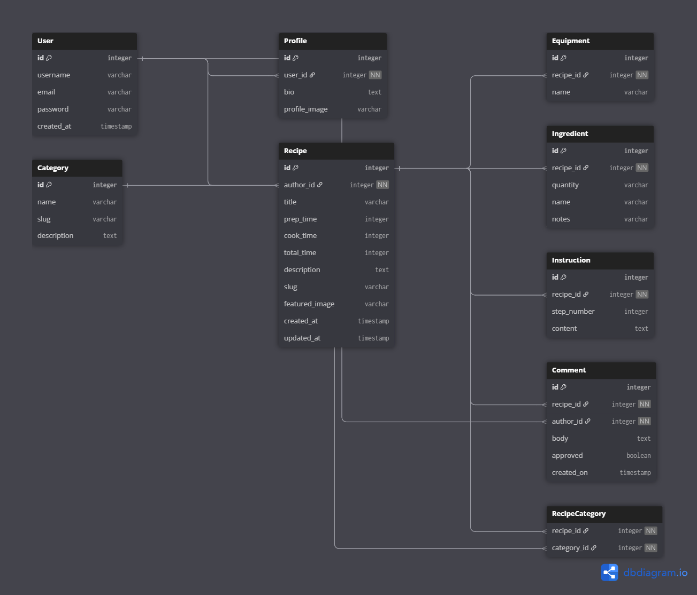
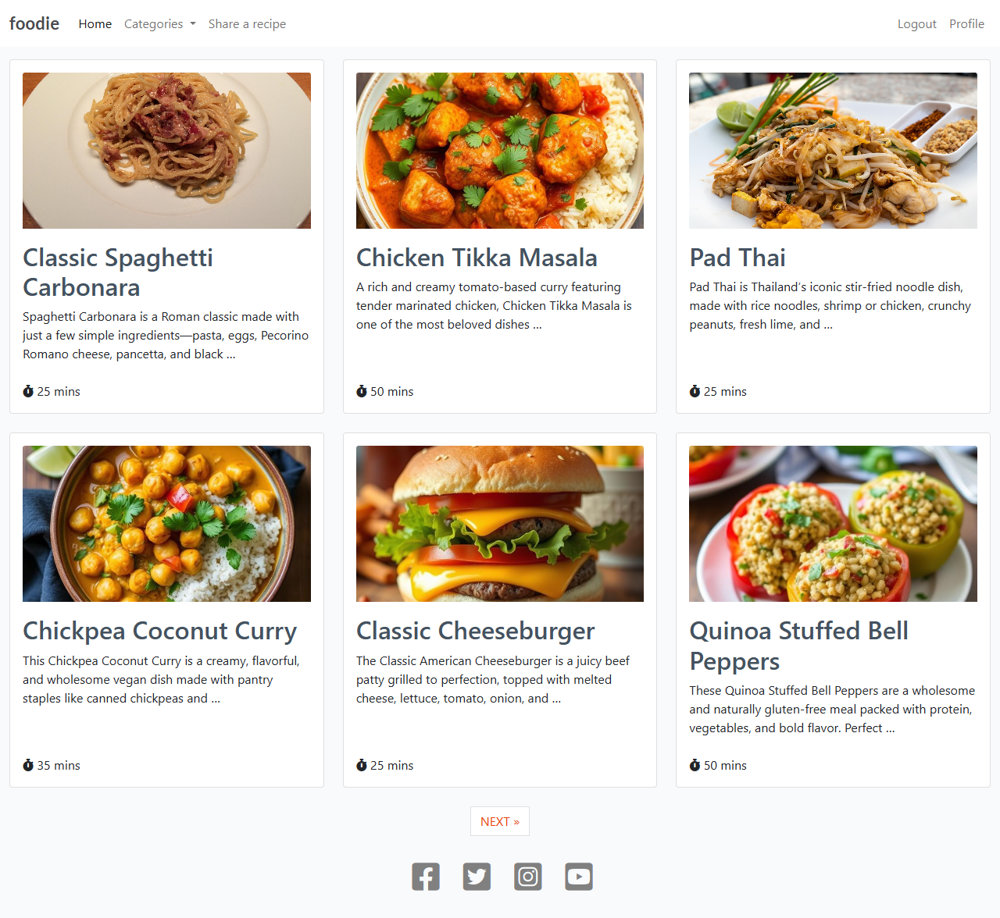
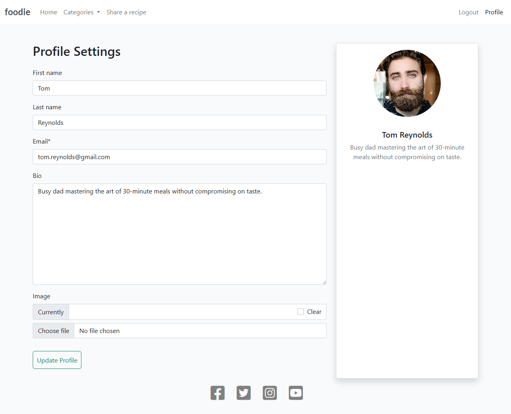

# foodie

foodie is a recipe-sharing platform where users can discover and share their favorite dishes. Browse a collection of recipes, share your own creations, and join the conversation with comments. A simple, social way to explore the world of cooking!


[View live site here](https://foodie-app-331441715045.herokuapp.com/)

## 📚 Table of Contents 

- [Planning](#planning)
  - [Target Audience](#target-audience)
  - [Project Goals](#project-goals)
  - [Feature Planning](#feature-planning)
- [Design](#design)
  - [Design Principles](#design-principles)
  - [Color Scheme](#color-scheme)
  - [Typography](#typography)
  - [Imagery](#imagery)
  - [Components and UI Elements](#components-and-ui-elements)
  - [Responsive Design](#responsive-design)
  - [Design for Accessibility](#design-for-accessibility)
  - [Wireframes](#wireframes)
- [Data Management](#data-management)
  - [User Data](#user-data)
  - [Recipe Data](#recipe-data)
- [Database Schema](#database-schema)
  - [Entity Relationship Diagram](#entity-relationship-diagram)
  - [Database Models](#database-models)
    - [User Profile Model](#user-model)
    - [Category Model](#category-model)
  - [Database Relationships](#database-relationships)
    - [One-to-One Relationships](#one-to-one-relationships)
    - [One-to-Many Relationships](#one-to-many-relationships)
    - [Many-to-Many Relationships](#many-to-many-relationships)
- [Database Optimization](#database-optimization)
- [Database Security](#database-security)
- [Database Schema Evolution](#database-schema-evolution)
- [Future Database Considerations](#future-database-considerations)  
- [Features](#features)
  - [Navigation](#navigation)
    - [Main Menu](#main-menu)
    - [Homepage](#homepage)  
  - [Product Details](#product-details)
  - [User Profile](#user-profile)
  - [Testimonials](#testimonials)
  - [Admin Features](#admin-features)
    - [User Management](#user-management)
    - [Category Management](#category-management)
  - [Additional Features](#additional-features)
    - [Error Pages](#error-pages)
    - [Security Features](#security-features)
  - [Future Features](#future-features)
- [Technologies Used](#technologies-used)
  - [Languages](#languages)
    - [HTML5](#html5)
    - [CSS3](#css3)
    - [Javascript](#javascript)
    - [Python](#python)
  - [Frameworks and Libraries](#frameworks-and-libraries)
    - [Django](#django)
    - [Bootstrap 5.3](#bootstrap-53)
    - [Django Extensions](#django-extensions)
    - [Font Awesome Icons](#font-awesome-icons)
    - [Bootstrap and Icons](#bootstrap-and-icons)
  - [Tools and Platforms](#tools-and-platforms)
    - [Git & GitHub](#git--github)
    - [Heroku](#heroku)
    - [PostgreSQL](#postgresql)
    - [gunicorn](#gunicorn)
    - [VSCode](#vscode)
    - [Chrome DevTools](#chrome-devtools)
  - [Third-Party Services](#third-party-services)
    - [Google Fonts](#google-fonts)
- [Credits](#credits)
  - [Code](#code)
  - [Content](#content)
  - [Media](#media)
- [Deployment](#deployment)
- [Testing](#testing)


## Planning

### Target Audience

- Home cooks and food enthusiasts looking for new recipes
- Bloggers and content creators sharing their culinary ideas
- People who want to engage with a community by commenting on recipes

### Project Goals

- Create an easy-to-use platform for discovering and sharing recipes
- Foster community interaction through comments
- Provide a visually appealing, responsive, and accessible user experience

### Feature Planning

Based on MoSCoW prioritization, we identified the following features:

#### Must Have Features

- User authentication (signup/login)
- Share and view recipes
- Commenting system on recipes
- Responsive design for all devices
- Image upload for recipes

#### Should Have Features

- Filter recipes by category
- User profiles with saved/uploaded recipes

#### Could Have Features

- Basic rating system (e.g., 1-5 stars)
- Search functionality
- Filter recipes by ingredients, cook time
- Social sharing (Twitter, Facebook, etc.)
- Recipe bookmarking/favorites

#### Won't Have Features (for now)

- Advanced meal-planning tools
- Video recipe uploads

## Design

### Design Principles

foodie's design follows these core principles:

- Simplicity: Clean, intuitive layouts prioritize usability.
- Consistency: Uniform buttons, fonts, and interactions for seamless navigation.
- Visual Hierarchy: Key actions (e.g., "Submit Recipe", "Delete Comment") stand out with color and spacing.

### Color Scheme

- Tomato Red

  - Used for interactive links (recipe titles, social media icons in the footer).

- Bootstrap Success Green

  - Submit buttons ("Share Recipe", "Save Changes", "Login").

- Bootstrap Danger Red

  - Delete/remove buttons ("Remove", "Logout").

- Neutral Backgrounds

  - Ensures readability and contrast.

### Typography

foodie inherits Bootstrap’s default font stack, designed for maximum readability across devices.

### Imagery

- Recipe images: High-quality photos are the centerpiece of each recipe card.

- User avatar images: Circular avatars appear next to recipe authors' names, creating a personal touch.

- Placeholder avatar images: Shown if no avatar is uploaded 

### Components and UI Elements

- Cards: Recipe cards with images, titles, and quick stats (likes, cooking time).

- Buttons: Rounded, interactive buttons for actions (submit, share, login).

- Navigation: Intuitive navbar with search functionality.

- Forms: Clean, user-friendly input fields for recipe creation and profile editing.

### Responsive Design

- Mobile (< 768px): Optimized for touch interactions, stacked layouts.

- Tablet/Desktop (768px+): Balanced grid layouts.

### Design for Accessibility

- Semantic HTML for screen readers.

- Sufficient color contrast.

- Keyboard-navigable interface.

### Wireframes

#### Home page wireframes

[Home page desktop](media/readme/desktop-homepage.png)

[Home page tablet](media/readme/tablet-homepage.png)

[Home page mobile](media/readme/mobile-homepage.png)

#### Recipe view wireframes

[Recipe view desktop](media/readme/desktop-recipe.png)

[Recipe view tablet](media/readme/tablet-recipe.png)

[Recipe view mobile](media/readme/mobile-recipe.png)

#### Category view wireframes

[Category view desktop](media/readme/category-view-desktop.png)

[Category view tablet](media/readme/category-view-tablet.png)

[Category view mobile](media/readme/mobile-category-view.png)

#### Login page wireframes

[Login page desktop](media/readme/signin-desktop.png)

[Login page  tablet](media/readme/login-page-tablet.png)

[Login page mobile](media/readme/login-page-mobile.png)

#### Logout page wireframes

[Logout page desktop](media/readme/signout-desktop.png)

[Logout page  tablet](media/readme/sign-out-tablet.png)

[Logout page mobile](media/readme/sign-out-mobile.png)

#### Sign-up page wireframes

[Sign-up page desktop]()

[Sign-up page tablet]()

[Sign-up page mobile]()

#### Profile page wireframes

[Profile page desktop]()

[Profile page tablet]()

[Profile page mobile]()

#### Share recipe wireframes

[Share recipe page desktop]()

[Share recipe tablet]()

[Share recipe mobile]()

## Data Management

### User Data

All personal data is protected through:

- HTTPS encryption
- Django's built-in security features

### Recipe Data

- Structured database using PostgreSQL for recipes.
- Comments stored with user references for moderation.

## Database Schema

### Entity Relationship Diagram

Below is the entity relationship diagram showing how different models are interconnected:



### Database Models

#### Users Model

The Users model extends Django's built-in User model to store users profile information:

```python
class Profile(models.Model):
    user = models.OneToOneField(User, on_delete=models.CASCADE)
    bio = models.TextField(max_length=500, blank=True)
    profile_image = CloudinaryField('image', blank=True, null=True, default=None)
```

**Key features**:

- One-to-one relationship with Django's User model
- Optional bio (500-character limit) and Cloudinary-hosted profile image
- Automatically created via signals when users register

#### Category Model

Organizes recipes into thematic groups (e.g., Vegan, Dessert):

```python
class Category(models.Model):
    name = models.CharField(max_length=50, unique=True)
    slug = models.SlugField(max_length=50, unique=True, blank=True)
    description = models.TextField(blank=True)
```

**Key features**:

- Auto-generated slugs from category names
- Optional descriptions
- Many-to-many relationship with recipes

#### Recipes Model

Core recipe content:

```python
class Recipe(models.Model):
    author = models.ForeignKey(User, on_delete=models.CASCADE)
    title = models.CharField(max_length=200)
    prep_time = models.PositiveIntegerField(help_text="Minutes")
    cook_time = models.PositiveIntegerField(help_text="Minutes")
    featured_image = CloudinaryField('image', default='placeholder')
    categories = models.ManyToManyField(Category, related_name='recipes', blank=True)
```

**Key features**:

- Time tracking (prep/cook/total) with auto-calculated total_time
- Cloudinary image hosting with default placeholder
- Categorization system with M:N relationships
- Automatic slug generation from title

#### Recipe Component Models

Modular design for recipe building blocks:

- Ingredients

```python
class Ingredient(models.Model):
    recipe = models.ForeignKey(Recipe, on_delete=models.CASCADE, related_name='ingredients')
    quantity = models.CharField(max_length=50, blank=True)
    name = models.CharField(max_length=100)
    notes = models.CharField(max_length=100, blank=True)
```
- Instructions

```python
class Instruction(models.Model):
    recipe = models.ForeignKey(Recipe, on_delete=models.CASCADE, related_name='instructions')
    step_number = models.PositiveIntegerField()
    content = models.TextField()
```

- Equipment

```python
class Equipment(models.Model):
    recipe = models.ForeignKey(Recipe, on_delete=models.CASCADE, related_name='equipment')
    name = models.CharField(max_length=100)
```

#### Comments Model

User-generated recipe comments:

```python
class Comment(models.Model):
    recipe = models.ForeignKey(Recipe, on_delete=models.CASCADE, related_name='comments')
    author = models.ForeignKey(User, on_delete=models.CASCADE, related_name='commenter')
    body = models.TextField()
    approved = models.BooleanField(default=False)
```

**Key features**:

- Moderation system (approved flag)
- Chronological ordering (newest first)
- Dual foreign keys to Recipe and User

### Database Relationships

#### One-to-One Relationships

User ↔ Profile

- Each Django User has exactly one Profile (extending user data)

- Each Profile links to exactly one User

#### One-to-Many Relationships

User → Recipes

- One User can author many Recipes
- Each Recipe belongs to one User

Recipe → Components

Each recipe can have:

- Many Ingredients
- Many Instructions
- Many Equipment entries

User → Comments

- One User can write many Comments
- Each Comment belongs to one User

Recipe → Comments

- One Recipe can have many Comments
- Each Comment belongs to one Recipe

#### Many-to-Many Relationships

Recipes ↔ Categories

- One Recipe can belong to many Categories (e.g., "Vegan" + "Italian")
- One Category can contain many Recipes

## Features

### Navigation

#### Navigation Bar

- Responsive Design: Transforms into a hamburger menu on mobile devices
- User Authentication: Login/Signup/Logout options that change based on authentication status
- Category Dropdown: Quick access to recipe categories
- Profile Link: Direct access to user profile for authenticated users


#### Homepage 

- Recipe Card Grid Layout: Recipes are displayed in a responsive card layout with images, titles, brief descriptions, and cooking time.
- Quick Recipe Browsing: Users can quickly scan through recipes with concise previews and high-quality images.
- Consistent Styling: Clean and modern UI design for a seamless experience across devices.
- Time Indicator: Each recipe card displays an estimated cooking time to help users choose recipes based on their available time.
- Responsive Layout: Optimized for both desktop and mobile devices.



### Recipe Details

**Recipe Content**

- Hero Recipe Image: A large, high-quality image of the dish prominently displayed at the top for visual appeal.
- Cooking Times Overview: Clear breakdown of preparation time, cooking time, and total time, helping users plan their cooking session.
- Ingredients List: Easy-to-read, structured list of all required ingredients.
- Step-by-Step Instructions: Clearly numbered or sectioned cooking steps to guide users through the recipe from start to finish.
- Equipment Needed: A dedicated section listing any necessary cooking tools or utensils.

**Author Bio Sidebar**

- The profile image of the recipe author
- A short bio to personalize the experience
- The number of recipes shared by the author, fostering community trust
- Comment Section: Users can leave feedback, ask questions, and share tips with other cooks,    promoting community engagement and interaction.
- Responsive Layout: Optimized for both desktop and mobile devices for on-the-go cooking.


### User Profile

Editable Profile Information:
  - First and last name
  - Email address
  - Personal bio to share their cooking style or background

- Profile Image Upload: Users can upload or update their profile photo, with the option to clear the existing image.
- Live Preview Panel: As users update their profile details, a real-time preview is shown on the right side featuring:
  - Profile picture
  - Full name
  - Bio
- Clean Layout: A clear and simple two-column design separates form inputs and profile display, enhancing usability.
- Update Confirmation: Changes can be saved with the "Update Profile" button, providing immediate feedback and a smooth editing process.
- Responsive Design: Ensures usability across mobile and desktop views.



### Recipe Sharing

Recipe Metadata Inputs:

- Title, Description, and Image Upload
- Prep Time, Cook Time, and auto-calculated Total Time

Category Selection: 

- Users can tag their recipe with one or more categories (e.g. Indian, Vegan, Desserts) for better discoverability.

Dynamic Form Sections:

- Equipment: 
  -Add one or more pieces of equipment needed for the recipe, with the ability to remove or add more dynamically.
- Ingredients: 
  -Specify quantity, name, and notes for each ingredient. Multiple ingredients can be added with ease.
- Instructions: 
  -Add clear, step-by-step instructions with an automatically tracked step number.

Live Profile Sidebar:
- Displays the user's profile image, name, username, recipe count, and member since year while they’re creating a recipe.

Form Validation: 
- Required fields are marked and validated to ensure complete recipe submissions.

Responsive Layout: 
- Designed for both desktop and mobile, enabling users to share recipes on the go.


### Admin Features

#### User Management

#### Category Management

### Additional Features

#### Error Pages

#### Security Features

## Technologies used

### Languages used

- HTML5

- CSS

- JavaScript

- Python

### Frameworks, Libraries, Tools and Platforms used

- Bootstrap 5.3.3

- Google Fonts

- Font Awesome

- Git

- GitHub

- Wireframes.cc

- Django

- Heroku

- PostgreSQL

- Chrome DevTools

## Credits

### Content

Entity Relationship Diagram was created with [dbdiagram](https://dbdiagram.io/)

Wireframes were created with [wireframes.cc](https://wireframes.cc)

Contents of the pages are created by [ChatGPT](https://openai.com)

### Media

The recipe and author profile images were sourced from Pixabay. All rights to the original content belong to their respective copyright holders.

- [Favicon](https://favicon.io/favicon-generator/)

- [Cloudinary](https://cloudinary.com/)

- [Icons](https://fontawesome.com/)

- [Images](https://pixabay.com/)

### Deployment

### Testing
